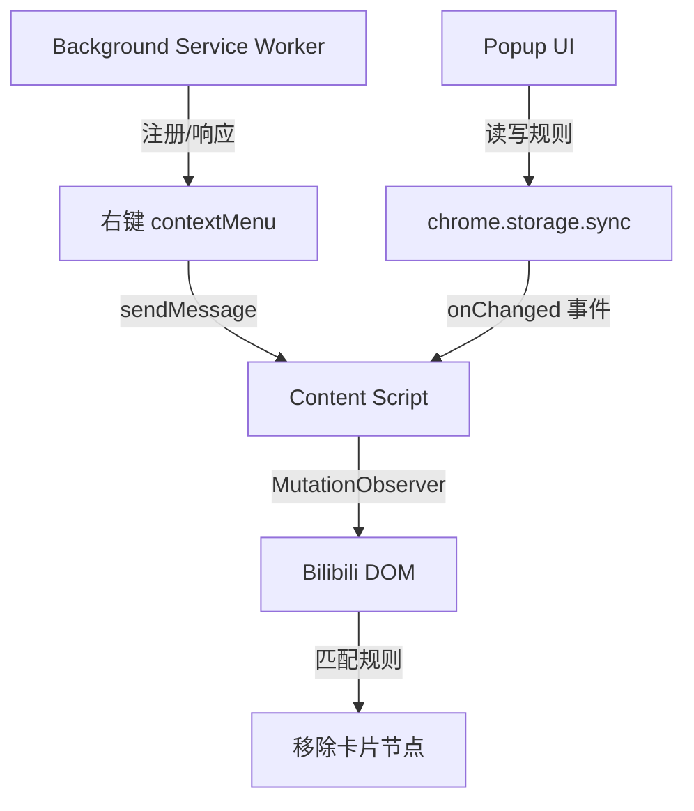

## 用户需求

开发一个 Chrome/Edge 浏览器扩展插件，用于屏蔽 Bilibili 网页端不想看的内容。

## 产品概述

基于 Manifest V3 的 Bilibili 内容屏蔽插件，通过 Content Script 实时监听页面 DOM 变化，对匹配规则的视频卡片执行移除操作。提供 Popup 管理界面和右键快捷菜单两种规则录入方式，规则持久化存储在本地。

## 核心功能

### 屏蔽类型

- **推广/广告内容**：自动识别并移除带有推广标识的视频卡片
- **UP 主屏蔽**：根据 UP 主名称精确匹配，移除其所有视频卡片
- **视频 Tag 屏蔽**：匹配视频 Tag 标签，移除包含指定 tag 的卡片
- **标题关键词屏蔽**：支持关键词模糊匹配视频标题，移除命中卡片

### 生效页面

- 首页推荐流（bilibili.com）
- 搜索结果页（search.bilibili.com）
- 分区/排行榜页
- 视频播放页侧栏推荐

### 规则管理

- **Popup 界面**：分类展示屏蔽规则列表，支持增删操作，一键开关插件
- **右键菜单**：在页面上右键视频卡片，快速将该 UP 主或标题关键词加入屏蔽列表

### 屏蔽效果

- 直接从 DOM 中移除匹配的视频卡片，不留占位，页面干净整洁

## 技术栈

- **扩展标准**：Chrome Extension Manifest V3
- **语言**：原生 JavaScript（ES2020+）、HTML5、CSS3
- **构建工具**：无（直接加载，便于开发调试）
- **存储**：`chrome.storage.sync`（规则跨设备同步）
- **通信**：`chrome.runtime.sendMessage` / `chrome.storage.onChanged`

## 实现方案

### 核心思路

Content Script 注入所有 Bilibili 页面，使用 `MutationObserver` 监听 DOM 动态插入（Bilibili 是 SPA，内容异步渲染），对每个新增视频卡片节点执行规则匹配，命中则直接 `element.remove()`。规则存储在 `chrome.storage.sync`，Content Script 监听 storage 变化实时更新本地规则缓存，无需重载页面。

### 关键技术决策

1. **MutationObserver 而非轮询**：Bilibili 页面为 Vue SPA，内容懒加载，Observer 比 `setInterval` 性能更优，精准捕获 DOM 插入事件。
2. **chrome.storage.sync 而非 localStorage**：规则跨设备同步，且 Content Script 与 Popup 共享同一 storage 命名空间，无需额外消息通信即可实现规则实时生效。
3. **右键菜单用 contextMenus API**：Manifest V3 支持 Service Worker 中注册 contextMenus，点击后通过 `sendMessage` 向 Content Script 请求提取当前鼠标悬停的卡片信息。
4. **无构建工具**：直接以目录加载扩展，零配置，开发调试友好。

### 性能考量

- MutationObserver 回调中批量处理 `addedNodes`，避免逐个触发
- 规则匹配使用本地缓存（内存变量），不在每次匹配时读 storage
- 推广卡片通过固定 CSS selector（如 `[data-type="ad"]`、`.bili-feed-card--ad`）直接移除，无需规则匹配

## 架构设计



## 目录结构

```
bili-blocker-browser/
├── manifest.json              # [NEW] MV3 扩展清单，声明权限、content_scripts、background、popup
├── background.js              # [NEW] Service Worker：注册右键菜单、处理菜单点击事件、转发消息给 Content Script
├── content.js                 # [NEW] 核心屏蔽逻辑：MutationObserver 监听 DOM、规则匹配、元素移除、监听 storage 变化更新规则缓存
├── popup/
│   ├── popup.html             # [NEW] Popup 页面结构：分 UP 主/Tag/关键词/广告四个规则分类，各自独立列表+输入框
│   ├── popup.css              # [NEW] Popup 样式：简洁现代风，宽度 380px，规则列表支持滚动，Tag 样式区分
│   └── popup.js               # [NEW] Popup 逻辑：读写 chrome.storage.sync，动态渲染规则列表，处理增删操作
└── icons/
    ├── icon16.png             # [NEW] 插件图标 16x16
    ├── icon48.png             # [NEW] 插件图标 48x48
    └── icon128.png            # [NEW] 插件图标 128x128
```

## 关键数据结构

规则存储格式（`chrome.storage.sync`）：

```js
// storage key: "blockRules"
{
  blockAds: true,          // 是否屏蔽推广内容（全局开关）
  upNames: ["xxx"],        // UP 主名称列表（精确匹配）
  tags: ["游戏", "带货"],  // tag 关键词列表（包含匹配）
  titleKeywords: ["标题"], // 标题关键词列表（包含匹配）
}
```

## 实现细节

- **Bilibili 选择器**：UP 主名称在 `.bili-video-card__info--author`、`.up-name` 等元素中；视频卡片根节点为 `.bili-video-card`、`.feed-card`；广告标识为 `[data-type="ad"]` 或卡片内含 `.bili-video-card__mark--ad`
- **右键菜单交互**：background.js 中用 `chrome.runtime.onMessage` 接收 content script 上报的「鼠标悬停卡片信息」，菜单点击后将 UP 主名写入 storage 即触发 content script 的 `onChanged` 自动更新
- **兼容性**：manifest.json 同时声明 Edge 兼容，无需额外改动

## 设计风格

Popup 界面采用简洁现代的深色主题，契合 Bilibili 夜间浏览场景。整体宽度 380px，高度自适应不超过 580px。圆角卡片分区布局，每个屏蔽类型对应一个独立面板，顶部为插件名称+全局开关，底部显示当前屏蔽数量统计。

## 页面设计

### Popup 主界面（单页）

**顶部导航栏**
插件 Logo + 名称「Bili Blocker」，右侧全局启用/禁用开关（toggle），背景深蓝渐变，高度 52px。

**广告屏蔽面板**
单行开关卡片，左侧图标+文字「自动屏蔽推广内容」，右侧 toggle，简洁无列表。

**UP 主屏蔽面板**
标题「屏蔽 UP 主」，下方规则列表（每项带删除按钮 ×），底部输入框+「添加」按钮，列表最大高度 120px 可滚动。

**Tag 屏蔽面板**
标题「屏蔽视频 Tag」，规则以 pill/chip 样式展示（可点击删除），底部输入框+「添加」按钮。

**标题关键词面板**
标题「屏蔽标题关键词」，列表展示，支持删除，底部输入框+「添加」按钮，列表最大高度 100px 可滚动。

**底部统计栏**
灰色小字显示「已屏蔽 x 条内容」（从 content script 获取计数），背景略深于主体。